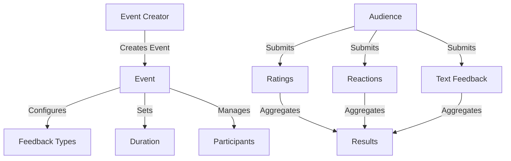

# PulseTide Live Feedback Platform

A blockchain-based solution for real-time, authenticated audience feedback during live events. PulseTide creates a transparent and tamper-proof record of audience sentiment while maintaining participant privacy.

## Overview

PulseTide enables:
- Real-time feedback collection during live events
- Multiple feedback types (ratings, reactions, text responses)
- Anonymous yet authenticated participation
- Transparent, immutable record of audience sentiment
- Dynamic event management and participant controls

### Key Features
- Create customizable feedback sessions
- Support for multiple feedback types
- Privacy-preserving feedback submission
- Real-time result aggregation
- Flexible event duration management
- Optional participant authentication

## Architecture

The PulseTide platform is built on a core smart contract that manages events, feedback collection, and result aggregation.



### Core Components
- Event Management System
- Participant Authentication
- Feedback Collection
- Result Aggregation
- Privacy Controls

## Contract Documentation

### pulsetide-core.clar

The main contract that handles all platform functionality.

#### Key Data Structures
- `events`: Stores event configuration and metadata
- `event-participants`: Tracks authorized participants
- `feedback-submissions`: Records individual feedback entries
- `event-rating-aggregates`: Maintains running statistics

#### Access Control
- Event creation: Public
- Event management: Creator only
- Feedback submission: Authorized participants
- Result viewing: Public

## Getting Started

### Prerequisites
- Clarinet
- Stacks wallet for deployment

### Installation
1. Clone the repository
2. Install dependencies with Clarinet
3. Deploy contracts to desired network

### Basic Usage

1. Create an event:
```clarity
(contract-call? .pulsetide-core create-event 
    "My Event" 
    "Event Description" 
    u1000 
    (list "rating" "reaction" "text") 
    u1 
    u5 
    false 
    true)
```

2. Submit feedback:
```clarity
(contract-call? .pulsetide-core submit-rating-feedback 
    event-id 
    u4 
    false)
```

## Function Reference

### Event Management

```clarity
(create-event (title (string-ascii 100)) 
             (description (string-utf8 500)) 
             (duration uint) 
             (feedback-types (list 10 (string-ascii 20))) 
             (min-rating uint) 
             (max-rating uint) 
             (requires-authentication bool) 
             (incentive-enabled bool))
```

```clarity
(close-event (event-id uint))
(extend-event-duration (event-id uint) (additional-blocks uint))
```

### Feedback Submission

```clarity
(submit-rating-feedback (event-id uint) (rating-value uint) (anonymous bool))
(submit-reaction-feedback (event-id uint) (reaction-value (string-ascii 20)) (anonymous bool))
(submit-text-feedback (event-id uint) (text-value (string-utf8 280)) (anonymous bool))
```

### Query Functions

```clarity
(get-event (event-id uint))
(get-event-feedback (event-id uint))
(get-average-rating (event-id uint))
```

## Development

### Testing
Run tests using Clarinet:
```bash
clarinet test
```

### Local Development
1. Start Clarinet console:
```bash
clarinet console
```

2. Deploy contracts:
```bash
clarinet deploy
```

## Security Considerations

### Limitations
- Block height-based timing
- Maximum feedback length restrictions
- Rate limiting through duplicate submission prevention

### Best Practices
- Always verify event status before submitting feedback
- Use anonymous submission for sensitive feedback
- Implement additional off-chain validation for text feedback
- Monitor event participation to prevent spam

### Privacy Guidelines
- Use anonymous submissions when participant privacy is important
- Consider the permanence of blockchain data when submitting text feedback
- Review event settings before enabling participant authentication